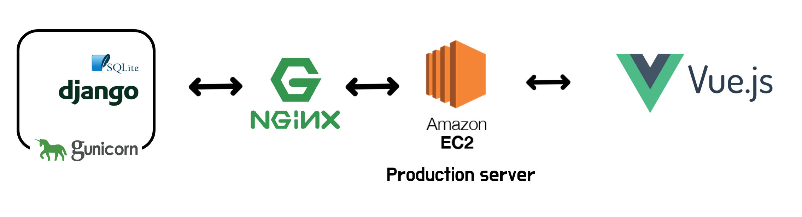
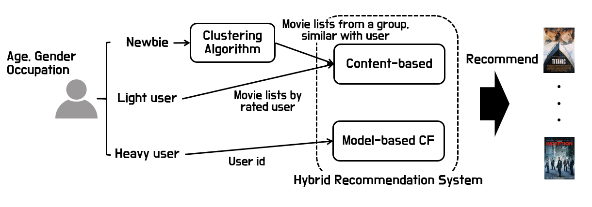

# YOUFLIX(Your flix)

This project is movie recommendation system based on switching hybrid recommendation system. The switching hybrid recommendation system is commonly considered as combination of model-based CF(Collaborative Filtering) and CB(Content-based Recommendation).


<p align="center">
    
</p>


http://youflix.twilightparadox.com (2019.11 Service ON)

※ DNS Hosting - FreeDNS


## Getting Started

These instructions will get you a copy of the project up and running on your local machine for development and testing purposes. See deployment for notes on how to deploy the project on a live system.


### Environment

- Ubuntu 18.04.3 LTS (AWS)
- Python 3.6.8


### Prerequisites

What things you need to install the software and how to install them. For convenience sake, all instructions what you need to start are in "prerequisites.sh". The only thing you have to do is executing bash file.

```bash
# Clone git repository
cd ~
git clone https://lab.ssafy.com/Jo_yongseok/youflix.git

# Install dependencies of pyenv
sudo apt-get install -y make build-essential \
 libssl-dev zlib1g-dev libbz2-dev libreadline-dev libsqlite3-dev \
 wget curl llvm libncurses5-dev libncursesw5-dev \
 xz-utils tk-dev git python-pip
 
# Install pyenv.
curl -L \
https://raw.githubusercontent.com/pyenv/pyenv-installer/master/bin/pyenv-installer \
| bash

# Setup environmental variables for pyenv
echo 'export PYENV_ROOT="$HOME/.pyenv"' >> ~/.bash_profile
echo 'export PATH="$PYENV_ROOT/bin:$PATH"' >> ~/.bash_profile
echo 'eval "$(pyenv init -)"' >> ~/.bash_profile
source ~/.bash_profile

# Install python 3.6.8
pyenv install 3.6.8

# Setup environmental variables for pyenv-virtualenv
echo 'eval "$(pyenv virtualenv-init -)"' >> ~/.bashrc

# Create virtual environment using pyenv-virtualenv
pyenv virtualenv youflix
```


### Installing

A step by step series of examples that tell you how to get a development environment running. For convenience sake, all instructions what you need to start are in "installation.sh". The only thing you have to do is executing bash file.

```bash
# Get current directory
dir=$(pwd)
# Django directory
djangoDIR="${dir}/django-vue/djangoAPI"
# Front directory
frontDIR="${dir}/frontend"
# Config directory
configDIR="${dir}/django-vue/.config"

# Delete prev database, pycache
rm "${djangoDIR}/db.sqlite3"
rm "${djangoDIR}/api/migrations/*_initial.py"
 
# Activate virtualenv
cd "${djangoDIR}"
pyenv activate youflix

# Install all packages
pip3 install -r requirements.txt

# Django database setup
python "${djangoDIR}/manage.py" makemigrations
python "${djangoDIR}/manage.py" migrate
python "${djangoDIR}/manage.py" loaddata "${djangoDIR}/json/collection.json"
python "${djangoDIR}/manage.py" loaddata "${djangoDIR}/json/company.json"
python "${djangoDIR}/manage.py" loaddata "${djangoDIR}/json/country.json"
python "${djangoDIR}/manage.py" loaddata "${djangoDIR}/json/genre.json"
python "${djangoDIR}/manage.py" loaddata "${djangoDIR}/json/keyword.json"
python "${djangoDIR}/manage.py" loaddata "${djangoDIR}/json/language.json"
python "${djangoDIR}/manage.py" loaddata "${djangoDIR}/json/movie.json"
python "${djangoDIR}/manage.py" loaddata "${djangoDIR}/json/crew.json"
python "${djangoDIR}/manage.py" loaddata "${djangoDIR}/json/cast.json"
python "${djangoDIR}/manage.py" loaddata "${djangoDIR}/json/user_profile_cluster.json"
python "${djangoDIR}/manage.py" loaddata "${djangoDIR}/json/rating.json"

# Create static root of youflix, for nginx
mkdir "${dir}/django-vue/.static_root"

# Gunicorn installation
sudo apt-get -y install gunicorn

# Nginx installation
sudo apt-get -y install nginx

# Nodejs
sudo apt-get -y install nodejs
sudo apt-get -y install npm

# NPM build
cd "${frontDIR}"
npm install
npm run build

# Django 
yes | python "${djangoDIR}/manage.py" collectstatic

# Reload daemon serivce (apply gunicorn.service)
sudo systemctl daemon-reload
```


## Deployment

Add additional notes about how to deploy this on a live system. Before we deploy this project on AWS EC2, gunicorn and nginx should be registered as daemon. Check "deployment.sh".

```bash
# Get current directory
dir=$(pwd)
# Config directory
configDIR="${dir}/django-vue/.config"
########################################################################
# Change configuration of .config files. Invalid path is exists
# gunicorn.service
# WorkingDirectory, ExecStart should be changed 
# nginx.service
# access_log, error_log, proxy_pass, alias should be changed
########################################################################

# Register Gunicorn as a daemon
sudo ln -s "${configDIR}/gunicorn/gunicorn.service" /etc/systemd/system/
mkdir "${djangoDIR}/run/"

# Register nginx app, youflix
sudo cp -f "${configDIR}/nginx/youflix.conf" /etc/nginx/sites-available/
sudo ln -s /etc/nginx/sites-available/youflix.conf /etc/nginx/sites-enabled/
touch "${djangoDIR}/logs/nginx-access.log"
touch "${djangoDIR}/logs/nginx-error.log"

# Start gunicorn, nginx
sudo systemctl start gunicorn.service
sudo systemctl start nginx.service
```


## Description

This project try to solve the cold start problem and propose new CB algorithm. Cold start is an old problem in the recommendation system. Recommendation system commonly provides service based on user's tastes, however, some cases do not have any information about the user. We overcome this problem with similar users' tastes using K-means clustering to group similar users by several features such as occupation, age, gender. Original CB is only able to apply in a one-to-one relationship. For instance, CB can estimate the similarity between a movie and a movie, but not movies and a movie. We propose a new algorithm to solve this problem.


### Architecture

An essential part of our project, movie recommendation, is mainly implemented using Python. We choose Django as a back-end for easy integration between server-side and recommendation part. Django does not guarantee high availability as a standalone web server in various environment, hence we combine Django with Nginx. This is widely used architecture to deploy Django server. Nginx is very powerful web server enabling load balancing or reverse proxies. That is why we provide services as the following architecture.  

<p align="center">
    
</p>


### Algorithm

As we mentioned, switching a hybrid recommendation system is used to recommend movies to users. We define three cases for users, newbie, light user, and heavy user to apply this algorithm. Here is an overview of the recommendation algorithm.

<p align="center">
    
</p>


CB recommendation performs well in the case user rates a few movies, compared with model-based CF. In contrast, model-based CF shows high performance when the user rates many movies.  Hence, in our system, CB is for the light users and model-based CF is for the heavy users. 


##### If you are interested in algorithms what we use, please check the below repositories.

- Model-based CF : https://github.com/BeautifulBeer/model-based-CF
- Content-based Algorithm : https://github.com/Karmantez/Content-Based-Algorithm


## License

This project is licensed under the Apache 2.0 License - see the LICENSE file for details


## References

- "A template to make good README.md", PurpleBooth, https://gist.github.com/PurpleBooth/109311bb0361f32d87a2 
- "파이썬 가상 개발 환경 구성: pyenv, virtualenv, autoenv, pip", 김태완, http://taewan.kim/post/python_virtual_env/