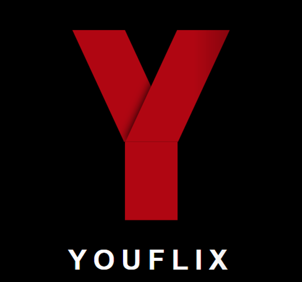

# YOUFLIX(Your flix)

This project is movie recommendation system based on switching hybrid recommendation system. The switching hybrid recommendation system is commonly considered as combination of model-based CF(Collaborative Filtering) and CB(Content-based Recommendation).

http://youflix.twilightparadox.com (2019.11 Service ON)

※ DNS Hosting - FreeDNS

## Getting Started

You can see all prerequisites to test this project in this link

## Description

The novelties of this project are solving the cold start problem and enhanced CB. Cold start is an old problem in the recommendation system. The system commonly provides service based on user's tastes, however, some cases do not have any information about the user. We overcome this problem with similar users' tastes using K-means clustering to group similar users by several features such as occupation, age, gender. Original CB is only able to apply in a one-to-one relationship. For instance, CB can estimate the similarity between a movie and a movie, but not movies and a movie. We propose a new algorithm to solve this problem.

### Architecture

An essential part of our project, movie recommendation, is mainly implemented using Python. We choose Django as a back-end for easy integration between server-side and recommendation part. Django does not guarantee high availability as a standalone web server, hence we combine Django with Nginx. Nginx has many advantages to process HTTP requests, however, these things are out of scope in this section. That is why we provide services as the following architecture.  

### Algorithm

As we mentioned, switching a hybrid recommendation system is used to recommend movies to users. We define three cases for users, newbie, light user, and heavy user to apply this algorithm. Here is an overview of the recommendation algorithm.

CB recommendation performs well in the case user rates a few movies, compared with model-based CF. In contrast, model-based CF shows high performance when the user rates many movies.  Hence, in our system, CB is for the light users and model-based CF is for the heavy users. 

## Deployment

We deploy this project on AWS EC2.

## License

This project is licensed under the Apache 2.0 License - see the LICENSE file for details